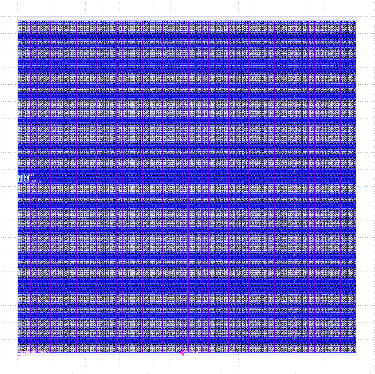
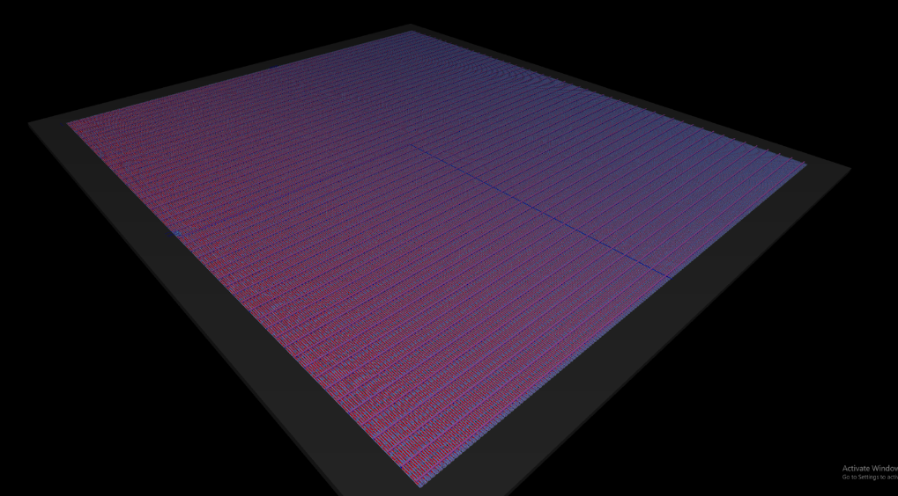

# AI Accelerator for Systolic Matricies and Activation Functions

This module implements a systolic processing engine that operates on four 3×3 matrices in parallel using Q8.24 fixed-point arithmetic. It incorporates a simple UART interface to receive data and—if desired—transmit computed results. The module supports several operations, selectable via opcodes.

---

## Table of Contents

- [Module Overview](#module-overview)
- [Pin Assignment](#pin-assignment)
- [Opcode Definitions](#opcode-definitions)
- [UART Interface Details](#uart-interface-details)
- [Memory Loading Process](#memory-loading-process)
- [Memory Unloading Process](#memory-unloading-process)
- [Systolic Array Processing](#systolic-array-processing)
- [Baud Rate](#baud-rate)
- [Usage](#usage)

---

## Module Overview

This design uses four parallel systolic arrays to perform 3×3 matrix multiplication (dot product) on fixed-point numbers in Q8.24 format. Depending on the opcode provided, the system may apply an activation function (ReLU, Leaky ReLU, Softmax, or Sigmoid) to the result immediately after multiplication. Data is loaded via a UART receiver into internal memory, processed by the systolic arrays, and then (optionally) unloaded via a UART transmitter.

---

## Pin Assignment

### Input Pins

| Pin | Description               |
|-----|---------------------------|
| 1   | Op-Code                   |
| 2   | Op-Code                   |
| 3   | Op-Code                   |
| 4   | Op-Code                   |
| 5   | Start                     |
| 6   | TX (UART RX pin)          |
| 7   | Clk                       |
| 8   | Reset                     |

### Output Pins

| Pin | Description              |
|-----|--------------------------|
| 1   | Done                     |
| 2   | Busy                     |
| 3   | RX (UART TX pin)         |
| 4   | (Unused)                 |
| 5   | (Unused)                 |
| 6   | (Unused)                 |
| 7   | (Unused)                 |
| 8   | (Unused)                 |

---

## Opcode Definitions

The 8-bit opcode is formed from the four provided opcode inputs (pins 1–4) with the upper four bits set to 0. The following table lists the opcodes (in binary and hexadecimal) and their corresponding operations:

| Opcode (Binary) | Opcode (Hex) | Operation                                                                  |
|-----------------|--------------|----------------------------------------------------------------------------|
| 0000 0000       | 0x00         | No-op – no operation (output remains unchanged)                          |
| 0000 0001       | 0x01         | 4-Parallel 3×3 Systolic Matrix Multiplier (dot product only, no activation) |
| 0000 0010       | 0x02         | Multiply then apply ReLU activation                                        |
| 0000 0011       | 0x03         | Multiply then apply Leaky ReLU activation                                  |
| 0000 0100       | 0x04         | Multiply then apply Softmax activation                                     |
| 0000 1010       | 0x0A         | Multiply then apply Sigmoid activation                                     |
| 1100 0000–1111  | —            | Reserved / No-op in this implementation                                   |

**Note:**  
- For opcodes **0x00** and **0x01**, no activation is applied after the multiplication.
- For opcodes **0x02, 0x03, 0x04, 0x0A**, the selected activation function is applied immediately after the multiplication stage.

---

## UART Interface Details

- **Baud Rate:** 100 Mbps  
  The module uses a timescale of 1 ns with a parameter `BAUD_TICKS` set to 10. With a bit period of 10 ns (1/10 ns), this results in a baud rate of 100 megabits per second.

- **UART RX:**  
  The UART receiver task continuously monitors the RX input. When a complete 8-bit byte (with start, data, and stop bits) is received, it asserts a valid flag (`rx_valid`) and provides the received byte (`rx_data`).

- **UART TX:**  
  The design includes a UART transmitter task that serializes output data with the proper framing. Although the code outlines the transmitter, unloading (or transmitting) the computed result is described conceptually for further implementation.

---

## Memory Loading Process

### Loading Matrix A Data (FSM_LOAD_A)

1. **Idle and Start:**  
   The FSM starts in an idle state. Upon assertion of `start_in`, it transitions to FSM_LOAD_A.

2. **Receiving Data:**  
   The UART receiver acquires one 8-bit byte at a time. When a full byte is received, the system:
   - Sign-extends the 8-bit data to a 32-bit signed value using:
     ```verilog
     A_data_packed[load_count*32 +: 32] = { {24{rx_data[7]}}, rx_data };
     ```
   - Increments a counter (`load_count`) used to index the memory location.

3. **Completion:**  
   This process continues until 36 words (9 words per array × 4 arrays = 36 words) have been loaded into `A_data_packed`.

### Loading Matrix B Data (FSM_LOAD_B)

1. **Transition:**  
   Once matrix A data is fully loaded, the FSM resets `load_count` and transitions to FSM_LOAD_B.

2. **Receiving and Storing:**  
   The same byte-wise process is repeated for matrix B, with each 8-bit value sign-extended and stored into `B_data_packed`.

### Data Packing After Load

An always-combinational section repacks the 36 words from both A_data_packed and B_data_packed into four contiguous 288-bit blocks. Each 288-bit block represents a 3×3 matrix and is stored in `A_blk_packed` or `B_blk_packed`.

---

## Memory Unloading Process

After the systolic arrays complete processing, the computed results are stored in `C_blk_packed` as a 1152-bit value (36 words of 32 bits). The unloading process works conceptually as follows:

1. **Unpacking the Results:**  
   The 1152-bit `C_blk_packed` is split back into 36 individual 32-bit words. These words can be further divided into 8-bit chunks if needed.

2. **Transmitting via UART:**  
   A transmit FSM or task iterates over the 36 words. For each word:
   - The word is segmented into 8-bit bytes.
   - Each byte is passed to the UART TX task which serializes the data (adding start and stop bits) and shifts it out on the TX line.

3. **Completion:**  
   Once all 36 words have been transmitted, the FSM returns to the idle state.

---

## Systolic Array Processing

The core of the design is the systolic array that executes a 3×3 matrix multiplication:

1. **Matrix Multiplication (CALC State):**  
   Each systolic array instance takes a 3×3 matrix from A_blk_packed and B_blk_packed (each 288 bits wide) and performs multiplication using an iterative dot-product approach over three iterations (N = 3). Partial products are accumulated into a temporary array.

2. **Activation (FINISH State):**  
   After multiplication, in the FINISH state, the FSM checks the opcode:
   - **0x01/0x00:** No activation is applied; the raw multiplication result is output.
   - **0x02:** ReLU is applied.
   - **0x03:** Leaky ReLU is applied.
   - **0x04:** Softmax is applied.
   - **0x0A:** Sigmoid is applied.

3. **Parallel Execution:**  
   Four systolic arrays operate in parallel on four distinct 3×3 blocks. Their computed outputs are repacked into C_blk_packed for eventual unloading.

---

## Baud Rate

With a timescale of 1 ns and `BAUD_TICKS = 10`, each UART bit period is 10 ns:
- **Baud Rate Calculation:**  
  \[
  \text{Baud rate} = \frac{1}{10\,\text{ns}} = 100\,\text{Mbps}
  \]

---

## Usage

1. **Data Loading:**  
   - Provide input data via the UART RX (pin 6).  
   - Assert the `start_in` signal (pin 5) to begin the loading process.  
   - The FSM will load 36 words into A_data_packed and 36 words into B_data_packed sequentially.

2. **Operation Selection:**  
   Set the op-code inputs (pins 1–4) according to the desired operation:
   - `0001` (0x01) for matrix multiplication only.
   - `0010` (0x02) for multiplication followed by ReLU.
   - `0011` (0x03) for multiplication followed by Leaky ReLU.
   - `0100` (0x04) for multiplication followed by Softmax.
   - `1010` (0x0A) for multiplication followed by Sigmoid.

3. **Processing:**  
   Once data is loaded, the FSM transitions to the processing stage (FSM_RUN), where the four parallel systolic arrays compute the results.

4. **Data Unloading:**  
   After processing, the computed results are stored in C_blk_packed. (A dedicated transmit mechanism can be implemented to unload these results via UART TX.)

5. **Status Monitoring:**  
   The module indicates processing status via:
   - **Done (Output Pin 1):** High when processing is complete.
   - **Busy (Output Pin 2):** High when processing is underway.
   - **RX (Output Pin 3):** Driven by the UART transmitter output.

---



